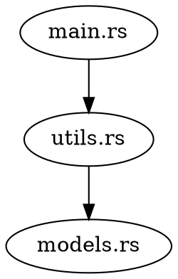

# 🚀 DevStack Visualizer — Rust CLI Version

> **Reference Document** — This file contains the full project specification, architecture, and implementation plan.
> Always refer to this file before coding, refactoring, or debugging.

---

## 0️⃣ High-Level Architecture

```
User Input (Project Path)
        |
        v
+-----------------------+
|  File System Scanner  |
+-----------------------+
        |
        v
+-----------------------+
| Language Detection    |
+-----------------------+
        |
        v
+-----------------------+
| AST Parser (Tree)     |
|  - Imports            |
|  - Modules            |
|  - Structs            |
|  - Functions          |
+-----------------------+
        |
        v
+-----------------------+
| Dependency Analyzer   |
+-----------------------+
        |
        v
+-----------------------+
| Graph Generator       |
|  (DOT format)         |
+-----------------------+
        |
        v
+-----------------------+
| Graphviz Renderer     |
+-----------------------+
        |
        v
Architecture Output
```

---

## 1️⃣ Project Structure

```
devstack-visualizer/
│
├── src/
│   ├── main.rs                  # Entry point
│   ├── cli.rs                   # CLI argument parsing (clap)
│   ├── scanner.rs               # File system scanner (walkdir)
│   ├── language_detector.rs     # Smart language/stack detection
│   ├── parser/
│   │     ├── mod.rs             # Parser trait + module exports
│   │     ├── rust_parser.rs     # Rust AST parser (tree-sitter-rust)
│   │     ├── python_parser.rs   # Python AST parser (tree-sitter-python)
│   │     └── js_parser.rs       # JS/TS AST parser (tree-sitter-javascript)
│   ├── analyzer.rs              # Dependency analyzer (petgraph)
│   ├── graph/
│   │     ├── mod.rs             # Graph module exports
│   │     ├── dot_generator.rs   # DOT format generator
│   │     └── renderer.rs        # Graphviz renderer (PNG/SVG/PDF)
│   └── output.rs                # Output formatting (summary, JSON, etc.)
│
├── tests/
│   └── sample_projects/
│       ├── rust_simple/
│       └── python_microservice/
│
├── Cargo.toml
└── PROJECT_SPEC.md              # ← This file
```

---

## 2️⃣ Dependencies (Cargo.toml)

```toml
[dependencies]
clap = { version = "4", features = ["derive"] }
walkdir = "2"
tree-sitter = "0.20"
tree-sitter-rust = "0.20"
petgraph = "0.6"
anyhow = "1"
serde = { version = "1", features = ["derive"] }
serde_json = "1"
rayon = "1"                  # Parallel file parsing
```

### Future / Optional Dependencies

```toml
tree-sitter-python = "0.20"
tree-sitter-javascript = "0.20"
tree-sitter-typescript = "0.20"
```

---

## 3️⃣ Implementation Phases

### 🥇 Phase 1 — CLI Setup (`cli.rs`)

**Crate:** `clap` v4 with derive macros.

**CLI Interface:**

```bash
devstack analyze ./my-project --output png
devstack analyze ./project --languages rust,python
```

**Arguments:**

| Argument        | Type     | Description                        |
|-----------------|----------|------------------------------------|
| `path`          | Required | Path to the project to analyze     |
| `--output`      | Optional | Output format: `png`, `svg`, `pdf` |
| `--languages`   | Optional | Filter: `rust`, `python`, `js`     |
| `--verbose`     | Flag     | Enable verbose logging             |
| `--summary`     | Flag     | Stack summary only                 |
| `--graph`       | Flag     | Architecture graph output          |
| `--complexity`  | Flag     | Complexity report                  |
| `--json`        | Flag     | Machine-readable JSON output       |
| `--detect-layers` | Flag  | Detect MVC / Clean Architecture    |

---

### 🥈 Phase 2 — File System Scanner (`scanner.rs`)

**Goal:** Recursively collect files by extension using `walkdir`.

**Extension Mapping:**

| Extension           | Language       |
|---------------------|----------------|
| `.rs`               | Rust           |
| `.py`               | Python         |
| `.js` / `.ts`       | JS/TS          |
| `.jsx` / `.tsx`     | React          |
| `Dockerfile`        | Docker         |
| `docker-compose.yml`| Docker Compose |

**Output Struct:**

```rust
struct ProjectFiles {
    rust_files: Vec<PathBuf>,
    python_files: Vec<PathBuf>,
    js_files: Vec<PathBuf>,
}
```

**Important:**
- Skip `target/`, `node_modules/`, `.git/`, `__pycache__/` directories.
- Limit file size threshold to avoid parsing huge generated files.

---

### 🥉 Phase 3 — Language Detection (`language_detector.rs`)

**Goal:** Smart detection beyond file extensions.

**Detection Rules:**

| Marker File          | Detected As      |
|----------------------|------------------|
| `Cargo.toml`        | Rust project     |
| `package.json`      | Node/React       |
| `requirements.txt`  | Python           |
| `go.mod`            | Go               |
| `Dockerfile`        | Containerized    |
| `docker-compose.yml`| Containerized    |

**Output Struct:**

```rust
struct ProjectStack {
    backend: Option<String>,
    frontend: Option<String>,
    database: Option<String>,
    containerized: bool,
}
```

---

### Phase 4 — AST Parsing with Tree-Sitter (`parser/`)

> **This is the core intelligence layer.**

**What to Extract from Each File:**

- `imports` / `use` statements
- Module declarations
- Struct / class definitions
- Function definitions
- External crate usage

**Rust Parser Example (`rust_parser.rs`):**

Tree-sitter AST structure:

```
(source_file
  (use_declaration ...)
  (function_item ...)
  (struct_item ...)
)
```

Traversal logic:

```rust
fn visit_node(node: Node, source: &str) {
    match node.kind() {
        "use_declaration" => extract_import(),
        "function_item"   => extract_function(),
        "struct_item"     => extract_struct(),
        _ => {}
    }
}
```

**Output Struct:**

```rust
struct FileAnalysis {
    file: PathBuf,
    imports: Vec<String>,
    functions: Vec<String>,
    structs: Vec<String>,
}
```

**Parser Trait (for multi-language extensibility):**

```rust
trait LanguageParser {
    fn parse(&self, path: &Path) -> FileAnalysis;
}
```

---

### Phase 5 — Dependency Analyzer (`analyzer.rs`)

**Goal:** Build a dependency graph from file analysis results.

**Example Relationships:**

```
file_a.rs → imports file_b.rs
file_b.rs → imports file_c.rs
```

**Implementation:**

- Use `petgraph::Graph<String, ()>`
- **Nodes:** Files / Modules
- **Edges:** Import relationships

---

### Phase 6 — Graph Generation (`graph/dot_generator.rs`)

**Goal:** Generate DOT format output.

**Example Output:**



**Save as:** `architecture.dot`

---

### Phase 7 — Graphviz Rendering (`graph/renderer.rs`)

**Goal:** Render DOT files using Graphviz.

**Command:**

```bash
dot -Tpng architecture.dot -o architecture.png
```

**From Rust:**

```rust
std::process::Command::new("dot")
    .args(&["-Tpng", "architecture.dot", "-o", "architecture.png"])
    .status()?;
```

**Supported Formats:**

- PNG
- SVG
- PDF

---

## 4️⃣ Advanced Features Roadmap

### 🔥 Feature 1 — Circular Dependency Detection

- Use `petgraph` DFS cycle detection.
- Output warning:

```
Warning: Circular dependency detected between:
A.rs ↔ B.rs
```

### 🔥 Feature 2 — Code Complexity Scoring

**Metrics:**

- Number of functions
- Number of lines
- Nesting depth

**Output:**

```
main.rs — Complexity: High
utils.rs — Complexity: Low
```

### 🔥 Feature 3 — Layer Detection (MVC / Clean Architecture)

**Detect folder names:**

```
/controllers
/services
/models
/repositories
```

**Generate grouped DOT subgraphs:**

```dot
subgraph cluster_controller { ... }
subgraph cluster_service { ... }
subgraph cluster_model { ... }
```

### 🔥 Feature 4 — Multi-Language Support

Add tree-sitter grammars:

- `tree-sitter-python`
- `tree-sitter-javascript`
- `tree-sitter-typescript`

All parsers implement the `LanguageParser` trait for extensibility.

---

## 5️⃣ Output Modes

| Flag           | Description              |
|----------------|--------------------------|
| `--summary`    | Stack summary only       |
| `--graph`      | Architecture graph       |
| `--complexity` | Complexity report        |
| `--json`       | Machine-readable output  |

---

## 6️⃣ Performance Considerations

- **Parallel parsing** using `rayon` crate
- **Cache results** to avoid re-parsing unchanged files
- **Skip directories:** `target/`, `node_modules/`, `.git/`, `__pycache__/`
- **File size threshold** — skip files above a configurable limit

---

## 7️⃣ Testing Strategy

**Test fixtures:**

```
tests/sample_projects/
    rust_simple/
    python_microservice/
```

**Snapshot testing for:**

- DOT output correctness
- JSON output correctness
- Dependency graph structure

---

## 8️⃣ Example Full CLI Usage

```bash
devstack analyze ./my-project \
    --output svg \
    --complexity \
    --detect-layers \
    --verbose
```

**Expected Output:**

```
Project Type: Rust Backend
Files Parsed: 42
Dependencies: 120 edges
Circular Dependencies: 2
Architecture Diagram: architecture.svg
```

---

## 9️⃣ Status Tracker

| Phase                          | Status      |
|--------------------------------|-------------|
| Phase 1 — CLI Setup            | ✅ Complete |
| Phase 2 — File System Scanner  | ✅ Complete |
| Phase 3 — Language Detection   | ✅ Complete |
| Phase 4 — AST Parsing          | ✅ Complete (Rust parser) |
| Phase 5 — Dependency Analyzer  | ✅ Complete |
| Phase 6 — DOT Graph Generation | ✅ Complete |
| Phase 7 — Graphviz Rendering   | ✅ Complete |
| Circular Dependency Detection  | ✅ Complete |
| Code Complexity Scoring        | ✅ Complete |
| Layer Detection (MVC)          | ✅ Complete |
| Multi-Language Parsers         | ⬜ Not Started |

> **Update this table as phases are completed.**

Also you have to update the status tracker part when project going on step by step
