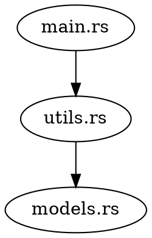

# 🚀 DevStack Visualizer — Tauri Desktop GUI

> **Reference Document** — This file contains the full project specification, architecture, and implementation plan.
> Always refer to this file before coding, refactoring, or debugging.

---

## 0️⃣ High-Level Architecture

```
┌──────────────────────────────────────────────────┐
│                 Tauri Desktop App                 │
│                                                   │
│  ┌─────────────────────────────────────────────┐  │
│  │          Frontend (React + TypeScript)       │  │
│  │                                              │  │
│  │  ProjectPicker ─► Toolbar ─► SettingsPanel   │  │
│  │        │                         │            │  │
│  │        v                         v            │  │
│  │   GraphView (react-flow / d3)   Sidebar      │  │
│  │   (interactive, zoomable)    (file details)   │  │
│  │        │                                      │  │
│  │        v                                      │  │
│  │   ExportDialog (PNG/SVG/PDF)                  │  │
│  └────────────┬────────────────────────────────┘  │
│               │  Tauri IPC (invoke / events)      │
│  ┌────────────▼────────────────────────────────┐  │
│  │          Backend (Rust)                      │  │
│  │                                              │  │
│  │  commands.rs ──► scanner.rs                  │  │
│  │       │              │                        │  │
│  │       │              v                        │  │
│  │       │     language_detector.rs              │  │
│  │       │              │                        │  │
│  │       │              v                        │  │
│  │       │     parser/ (Tree-Sitter AST)        │  │
│  │       │              │                        │  │
│  │       │              v                        │  │
│  │       │     analyzer.rs (petgraph)           │  │
│  │       │              │                        │  │
│  │       │              v                        │  │
│  │       └────► graph/ (DOT export)             │  │
│  │              renderer.rs (PNG/SVG/PDF)        │  │
│  └──────────────────────────────────────────────┘  │
└──────────────────────────────────────────────────┘
```

---

## 1️⃣ Project Structure

```
devstack-visualizer/
│
├── src-tauri/                       # Tauri + Rust backend
│   ├── src/
│   │   ├── main.rs                  # Tauri entry point & app builder
│   │   ├── commands.rs              # Tauri command handlers (IPC bridge)
│   │   ├── scanner.rs               # File system scanner (walkdir)
│   │   ├── language_detector.rs     # Smart language/stack detection
│   │   ├── parser/
│   │   │     ├── mod.rs             # Parser trait + module exports
│   │   │     ├── rust_parser.rs     # Rust AST parser (tree-sitter-rust)
│   │   │     ├── python_parser.rs   # Python AST parser (tree-sitter-python)
│   │   │     └── js_parser.rs       # JS/TS AST parser (tree-sitter-javascript)
│   │   ├── analyzer.rs              # Dependency analyzer (petgraph)
│   │   ├── graph/
│   │   │     ├── mod.rs             # Graph module exports
│   │   │     ├── dot_generator.rs   # DOT format generator
│   │   │     └── renderer.rs        # Graphviz renderer (PNG/SVG/PDF export)
│   │   └── output.rs               # Output formatting / serialization
│   ├── Cargo.toml                   # Rust dependencies
│   └── tauri.conf.json              # Tauri app configuration
│
├── src/                             # Frontend (React + TypeScript)
│   ├── App.tsx                      # Main application component
│   ├── main.tsx                     # React entry point
│   ├── components/
│   │   ├── GraphView.tsx            # Interactive dependency graph (zoomable, pannable)
│   │   ├── Sidebar.tsx              # File detail sidebar (imports, structs, functions)
│   │   ├── Toolbar.tsx              # Actions: open project, export, settings
│   │   ├── ProjectPicker.tsx        # Folder picker dialog
│   │   ├── SettingsPanel.tsx        # Preferences & configuration
│   │   └── ExportDialog.tsx         # Export graph as PNG/SVG/PDF
│   ├── hooks/
│   │   └── useTauriCommands.ts      # React hooks for Tauri IPC calls
│   ├── styles/
│   │   └── ...                      # CSS / Tailwind styles
│   └── types/
│       └── index.ts                 # Shared TypeScript types
│
├── package.json                     # Frontend dependencies
├── tsconfig.json                    # TypeScript configuration
├── vite.config.ts                   # Vite bundler config
│
├── tests/
│   └── sample_projects/
│       ├── rust_simple/
│       └── python_microservice/
│
└── PROJECT_SPEC.md                  # ← This file
```

---

## 2️⃣ Dependencies

### Rust / Backend (`src-tauri/Cargo.toml`)

```toml
[dependencies]
tauri = { version = "2", features = ["dialog-open", "shell-open"] }
walkdir = "2"
tree-sitter = "0.24"
tree-sitter-rust = "0.23"
petgraph = "0.6"
anyhow = "1"
serde = { version = "1", features = ["derive"] }
serde_json = "1"
rayon = "1"                      # Parallel file parsing
notify = "6"                     # File system watcher (real-time analysis)
```

### Future / Optional Rust Dependencies

```toml
tree-sitter-python = "0.23"
tree-sitter-javascript = "0.23"
tree-sitter-typescript = "0.23"
```

### Frontend (`package.json`)

```json
{
  "dependencies": {
    "react": "^18",
    "react-dom": "^18",
    "@tauri-apps/api": "^2",
    "reactflow": "^11",
    "d3": "^7"
  },
  "devDependencies": {
    "typescript": "^5",
    "@tauri-apps/cli": "^2",
    "vite": "^5",
    "@vitejs/plugin-react": "^4",
    "tailwindcss": "^3",
    "autoprefixer": "^10",
    "postcss": "^8"
  }
}
```

---

## 3️⃣ Implementation Phases

### 🥇 Phase 1 — Tauri App Scaffolding & Project Setup

**Goal:** Initialize Tauri v2 project, set up React + TypeScript frontend, wire up the build pipeline.

**Steps:**

1. Run `npm create tauri-app@latest` or manually scaffold the Tauri project.
2. Move existing Rust source files into `src-tauri/src/`.
3. Remove `clap` / CLI code (`cli.rs`) — the GUI replaces CLI interaction.
4. Set up `tauri.conf.json` with app name, window size, and permissions.
5. Configure Vite + React + TypeScript for the frontend.
6. Verify the app launches with a blank React page inside the Tauri window.

**Key Config (`tauri.conf.json` highlights):**

```json
{
  "app": {
    "windows": [
      {
        "title": "DevStack Visualizer",
        "width": 1280,
        "height": 800,
        "resizable": true
      }
    ]
  },
  "build": {
    "devUrl": "http://localhost:1420",
    "frontendDist": "../dist"
  }
}
```

---

### 🥇 Phase 1b — Tauri Commands / IPC Bridge (`commands.rs`)

**Goal:** Expose backend analysis functions to the frontend via Tauri commands.

**Commands to implement:**

| Command               | Input                     | Output                        |
|-----------------------|---------------------------|-------------------------------|
| `analyze_project`     | `path: String`            | `AnalysisResult` (JSON)       |
| `get_file_details`    | `path: String`            | `FileAnalysis` (JSON)         |
| `export_graph`        | `format: String, path: String` | File saved to disk      |
| `detect_stack`        | `path: String`            | `ProjectStack` (JSON)         |
| `get_complexity`      | `path: String`            | `Vec<ComplexityReport>` (JSON)|
| `detect_layers`       | `path: String`            | `LayerInfo` (JSON)            |

**Example command:**

```rust
#[tauri::command]
fn analyze_project(path: String) -> Result<AnalysisResult, String> {
    // Scan → parse → analyze → return graph data as JSON
}
```

All commands registered in `main.rs`:

```rust
fn main() {
    tauri::Builder::default()
        .invoke_handler(tauri::generate_handler![
            analyze_project,
            get_file_details,
            export_graph,
            detect_stack,
            get_complexity,
            detect_layers,
        ])
        .run(tauri::generate_context!())
        .expect("error running tauri application");
}
```

---

### 🥈 Phase 2 — File System Scanner (`scanner.rs`)

**Goal:** Recursively collect files by extension using `walkdir`.

**Extension Mapping:**

| Extension           | Language       |
|---------------------|----------------|
| `.rs`               | Rust           |
| `.py`               | Python         |
| `.js` / `.ts`       | JS/TS          |
| `.jsx` / `.tsx`     | React          |
| `Dockerfile`        | Docker         |
| `docker-compose.yml`| Docker Compose |

**Output Struct:**

```rust
struct ProjectFiles {
    rust_files: Vec<PathBuf>,
    python_files: Vec<PathBuf>,
    js_files: Vec<PathBuf>,
}
```

**Important:**
- Skip `target/`, `node_modules/`, `.git/`, `__pycache__/` directories.
- Limit file size threshold to avoid parsing huge generated files.

---

### 🥉 Phase 3 — Language Detection (`language_detector.rs`)

**Goal:** Smart detection beyond file extensions.

**Detection Rules:**

| Marker File          | Detected As      |
|----------------------|------------------|
| `Cargo.toml`        | Rust project     |
| `package.json`      | Node/React       |
| `requirements.txt`  | Python           |
| `go.mod`            | Go               |
| `Dockerfile`        | Containerized    |
| `docker-compose.yml`| Containerized    |

**Output Struct:**

```rust
struct ProjectStack {
    backend: Option<String>,
    frontend: Option<String>,
    database: Option<String>,
    containerized: bool,
}
```

---

### Phase 4 — AST Parsing with Tree-Sitter (`parser/`)

> **This is the core intelligence layer.**

**What to Extract from Each File:**

- `imports` / `use` statements
- Module declarations
- Struct / class definitions
- Function definitions
- External crate usage

**Rust Parser Example (`rust_parser.rs`):**

Tree-sitter AST structure:

```
(source_file
  (use_declaration ...)
  (function_item ...)
  (struct_item ...)
)
```

Traversal logic:

```rust
fn visit_node(node: Node, source: &str) {
    match node.kind() {
        "use_declaration" => extract_import(),
        "function_item"   => extract_function(),
        "struct_item"     => extract_struct(),
        _ => {}
    }
}
```

**Output Struct:**

```rust
struct FileAnalysis {
    file: PathBuf,
    imports: Vec<String>,
    functions: Vec<String>,
    structs: Vec<String>,
}
```

**Parser Trait (for multi-language extensibility):**

```rust
trait LanguageParser {
    fn parse(&self, path: &Path) -> FileAnalysis;
}
```

---

### Phase 5 — Dependency Analyzer (`analyzer.rs`)

**Goal:** Build a dependency graph from file analysis results.

**Example Relationships:**

```
file_a.rs → imports file_b.rs
file_b.rs → imports file_c.rs
```

**Implementation:**

- Use `petgraph::Graph<String, ()>`
- **Nodes:** Files / Modules
- **Edges:** Import relationships

---

### Phase 6 — Graph Generation (`graph/dot_generator.rs`)

**Goal:** Generate DOT format output.

**Example Output:**



**Save as:** `architecture.dot`

---

### Phase 7 — Graphviz Rendering / Export (`graph/renderer.rs`)

**Goal:** Render DOT files using Graphviz for **export only** (PNG/SVG/PDF). In-app visualization uses the interactive frontend graph.

**Command:**

```bash
dot -Tpng architecture.dot -o architecture.png
```

**From Rust:**

```rust
std::process::Command::new("dot")
    .args(&["-Tpng", "architecture.dot", "-o", "architecture.png"])
    .status()?;
```

**Supported Export Formats:**

- PNG
- SVG
- PDF

---

### 🆕 Phase 8 — Frontend: Interactive Graph View (`GraphView.tsx`)

**Goal:** Render the dependency graph interactively in the browser using `react-flow` or `d3.js`.

**Features:**

- **Zoomable & pannable** canvas for large graphs
- **Clickable nodes** — clicking a file node opens its details in the Sidebar
- **Colored edges** — highlight circular dependencies in red
- **Grouped subgraphs** — cluster nodes by detected architecture layers (MVC)
- **Search / filter** — filter nodes by file name or language
- **Auto-layout** — use dagre or elk layout algorithms for clean positioning

**Data flow:**

1. Frontend calls `invoke('analyze_project', { path })` via Tauri IPC.
2. Rust backend returns `AnalysisResult` (nodes + edges + metadata).
3. Frontend transforms the result into react-flow nodes/edges and renders.

---

### 🆕 Phase 9 — Frontend: Project Picker & Toolbar

**Goal:** Let users select a project folder and control the app from a toolbar.

**ProjectPicker:**
- Uses Tauri's native file dialog (`@tauri-apps/api/dialog`) to open a folder picker.
- Selected path is sent to the backend for analysis.

**Toolbar:**
- **Open Project** button → triggers folder picker
- **Export** button → opens ExportDialog (PNG/SVG/PDF)
- **Settings** button → opens SettingsPanel
- **Re-analyze** button → re-runs analysis on current project

---

### 🆕 Phase 10 — Frontend: File Detail Sidebar (`Sidebar.tsx`)

**Goal:** Show detailed information for a selected file/node.

**Displayed Info:**

- File path
- Language
- Imports list
- Exported structs / classes
- Function signatures
- Complexity score
- Incoming / outgoing dependencies

**Interaction:** Clicking a node in `GraphView` calls `invoke('get_file_details', { path })` and populates the Sidebar.

---

### 🆕 Phase 11 — Frontend: Settings & Export

**SettingsPanel:**
- Language filter (Rust, Python, JS/TS)
- Complexity threshold
- Graph layout direction (top-down, left-right)
- Theme (light / dark)

**ExportDialog:**
- Format picker: PNG, SVG, PDF
- Calls `invoke('export_graph', { format, path })` to generate the file on disk
- Shows success/failure notification

---

### 🆕 Phase 12 — Real-Time Analysis (File Watcher)

**Goal:** Automatically re-analyze when project files change.

**Implementation:**

- Use the `notify` crate on the Rust side to watch the project directory.
- On file change, emit a Tauri event (`tauri::Manager::emit`) to the frontend.
- Frontend listens for the event and re-fetches analysis data.
- Debounce rapid changes (300ms) to avoid excessive re-analysis.

**Rust side:**

```rust
use notify::{Watcher, RecursiveMode, watcher};

// Watch project directory, emit "project-changed" event on modifications
```

**Frontend side:**

```typescript
import { listen } from '@tauri-apps/api/event';

listen('project-changed', () => {
  // Re-run analysis
});
```

---

## 4️⃣ Advanced Features Roadmap

### 🔥 Feature 1 — Circular Dependency Detection

- Use `petgraph` DFS cycle detection.
- Output warning:

```
Warning: Circular dependency detected between:
A.rs ↔ B.rs
```

### 🔥 Feature 2 — Code Complexity Scoring

**Metrics:**

- Number of functions
- Number of lines
- Nesting depth

**Output:**

```
main.rs — Complexity: High
utils.rs — Complexity: Low
```

### 🔥 Feature 3 — Layer Detection (MVC / Clean Architecture)

**Detect folder names:**

```
/controllers
/services
/models
/repositories
```

**Generate grouped DOT subgraphs:**

```dot
subgraph cluster_controller { ... }
subgraph cluster_service { ... }
subgraph cluster_model { ... }
```

### 🔥 Feature 4 — Multi-Language Support

Add tree-sitter grammars:

- `tree-sitter-python`
- `tree-sitter-javascript`
- `tree-sitter-typescript`

All parsers implement the `LanguageParser` trait for extensibility.

---

## 5️⃣ GUI Views & Panels

| View / Panel     | Description                                         |
|------------------|-----------------------------------------------------|
| **GraphView**    | Interactive dependency graph (zoom, pan, click)     |
| **Sidebar**      | File details: imports, structs, functions, complexity|
| **Toolbar**      | Open project, export, settings, re-analyze          |
| **ProjectPicker**| Native folder selection dialog                      |
| **SettingsPanel**| Language filter, theme, layout, complexity threshold |
| **ExportDialog** | Export graph to PNG / SVG / PDF                     |

---

## 6️⃣ Performance Considerations

- **Parallel parsing** using `rayon` crate
- **Cache results** to avoid re-parsing unchanged files
- **Skip directories:** `target/`, `node_modules/`, `.git/`, `__pycache__/`, `dist/`
- **File size threshold** — skip files above a configurable limit
- **Debounced file watching** — avoid overwhelming the system with rapid re-analyses
- **Backend-driven computation** — all heavy work (scanning, parsing, graph building) runs in Rust; frontend only renders

---

## 7️⃣ Testing Strategy

**Test fixtures:**

```
tests/sample_projects/
    rust_simple/
    python_microservice/
```

**Snapshot testing for:**

- DOT output correctness
- JSON output correctness
- Dependency graph structure

---

## 8️⃣ Example GUI Workflow

1. **Launch app** → DevStack Visualizer window opens.
2. **Click "Open Project"** → native folder picker dialog appears.
3. **Select project directory** → backend scans, parses, and analyzes.
4. **Interactive graph** renders in the main view — zoom, pan, click nodes.
5. **Click a node** → Sidebar shows file details (imports, structs, functions, complexity).
6. **Click "Export"** → choose PNG/SVG/PDF → file saved to disk.
7. **Edit a source file** → file watcher detects change → graph re-renders automatically.

---

## 9️⃣ Status Tracker

| Phase                                    | Status      |
|------------------------------------------|-------------|
| Phase 1 — Tauri App Scaffolding          | ⬜ Not Started |
| Phase 1b — Tauri Commands / IPC Bridge   | ⬜ Not Started |
| Phase 2 — File System Scanner            | ✅ Complete (needs migration to src-tauri/) |
| Phase 3 — Language Detection             | ✅ Complete (needs migration to src-tauri/) |
| Phase 4 — AST Parsing                   | ✅ Complete — Rust parser (needs migration to src-tauri/) |
| Phase 5 — Dependency Analyzer            | ✅ Complete (needs migration to src-tauri/) |
| Phase 6 — DOT Graph Generation           | ✅ Complete (needs migration to src-tauri/) |
| Phase 7 — Graphviz Export                | ✅ Complete (needs migration to src-tauri/) |
| Phase 8 — Frontend: Interactive Graph    | ⬜ Not Started |
| Phase 9 — Frontend: Project Picker & Toolbar | ⬜ Not Started |
| Phase 10 — Frontend: File Detail Sidebar | ⬜ Not Started |
| Phase 11 — Frontend: Settings & Export   | ⬜ Not Started |
| Phase 12 — Real-Time File Watcher        | ⬜ Not Started |
| Circular Dependency Detection            | ✅ Complete |
| Code Complexity Scoring                  | ✅ Complete |
| Layer Detection (MVC)                    | ✅ Complete |
| Multi-Language Parsers                   | ⬜ Not Started |

> **Update this table as phases are completed.**

Also you have to update the status tracker part when project going on step by step
